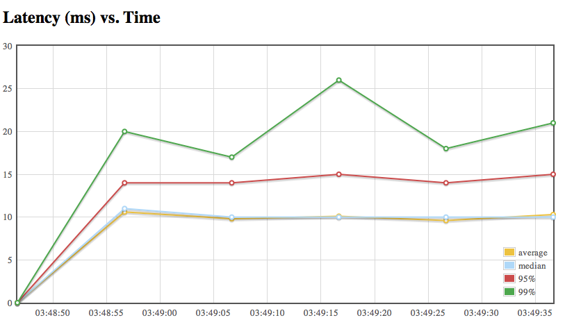
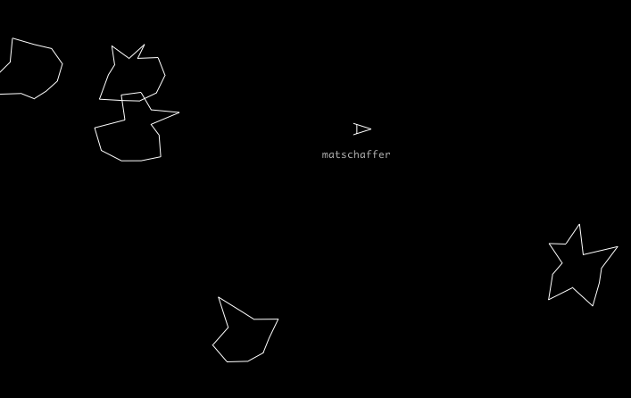
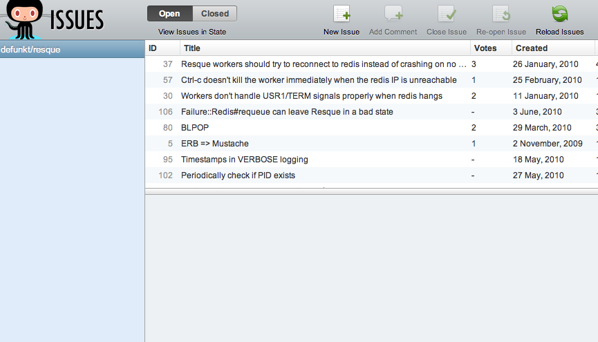
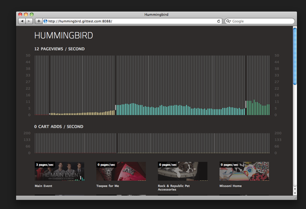
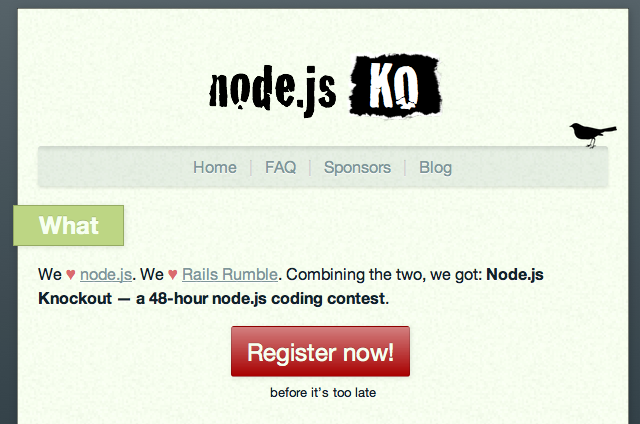

!SLIDE center

# in 30 minutes or less

## Mat Schaffer
### Philly.rb, June 21, 2010##

!SLIDE
# What is Node?

!SLIDE center

http://www.flickr.com/photos/cop4cbt/3737600395/

!SLIDE center

# Chome? (and V8?)

!SLIDE
# Event Machine?

!SLIDE

##  + EventMachine

## JavaScript on top of an event-based system API

!SLIDE center

http://icanhascheezburger.com/2008/12/30/funny-pictures-confusion/

!SLIDE bullets
## The idea: Time is wasted waiting for IO

* HTTP requests to services
* Writes to disk
* Writes to DB
* Threads help, but hard to get right.

!SLIDE
## Why not just register a callback so we can keep moving?

    @@@ JavaScript
    fs.readFile(callback)
    dns.resolve4('www.google.com', callback)
    net.createServer(callback)

!SLIDE center

## For web this means handling lots of concurrent requests without much trouble

http://www.flickr.com/photos/vladdythephotogeek/3431099472/

!SLIDE
# Getting Node.js

!SLIDE
## Compiling from source is straight-forward

    $ git clone git://github.com/ry/node.git
    $ cd node
    $ ./configure --prefix=/usr/local
    $ make
    $ make install || sudo make install 

!SLIDE
## Your package manager probably calls it "node"

    $ brew install node

!SLIDE
# Node basics

!SLIDE

    @@@ JavaScript
    var sys = require('sys');
    sys.puts('hello world');

    $ node helloworld.js
    hello world

!SLIDE

## Note the `sys = require('sys')`.
## Each file is expected to export an object as `module.exports`
## this comes from CommonJS

!SLIDE
# Handling web requests

!SLIDE

    @@@ JavaScript
    var http = require('http');

    http.createServer(function (req, res) {
      res.writeHead(200,
        {'Content-Type': 'text/plain'});
      res.end("Hello world\n");
    }).listen(8000);

!SLIDE

    $ ./nodeload.js -f -n 100000 -i 10 -c 20 \
      http://localhost:3000/
    Requests per second: 1748.19
    (on a VirtualBox VM)

 
http://github.com/benschmaus/nodeload

!SLIDE center

!SLIDE
## Writing asynchronous systems looks a little different
## instead of

    @@@ JavaScript
    things.each(function(thing) {
      doStuffWith(i);
    });

## you do...

!SLIDE

    @@@ JavaScript
    things.each(function(thing, next) {
      doStuffWith(i, next);
    });

## More at http://timetobleed.com/eventmachine-scalable-non-blocking-io-in-ruby/

!SLIDE
#Testable?

!SLIDE bullets
##Sure.

* JSpec w/ recorderMock.js
* Expresso (has code coverage!)
* Node.js comes with an assert lib

!SLIDE
# Cool node projects

!SLIDE 

# Express (sinatra-ish)

    @@@ JavaScript
    require('express')

    get('/', function(){
      this.contentType('html')
      return '<h1>Welcome To Express</h1>'
    })

    run()

http://expressjs.com/

!SLIDE

# Connect (rack-ish)

    @@@ JavaScript
    module.exports = require('./lib/connect').
                     createServer([
      { filter: 'log' },
      { module: require('custom/middleware') },
      { provider: 'static',
        root: __dirname + '/public' }
    ]);

http://extjs.github.com/Connect/

!SLIDE

# (fab) (???)

    @@@ JavaScript
    with ( require( "fab" ) ) 
    ( fab )
      ( listen, 0xFAB )
      ( /^\/hello/ )
        ( tmpl )
          ( "Hello, <%= this %>!" )
        ( /^\/(\w+)$/ )
          ( capture.at, 0 )
          ( "world" )
      ( 404 );

http://github.com/jed/fab

!SLIDE

# Socket.IO

## Node.js Server and In-Browser Client for simplifying realtime message passing.
## http://socket.io

!SLIDE center

## Massively multiplayer asteroids!!1!1!!!

http://lazeroids.com/

!SLIDE center

## Mac-ish in a browser!!11!!!

http://githubissues.heroku.com/#defunkt/resque

!SLIDE center

## Analytics pr0n!11!!!!1

http://mnutt.github.com/hummingbird/

!SLIDE center

http://nodeknockout.com/
